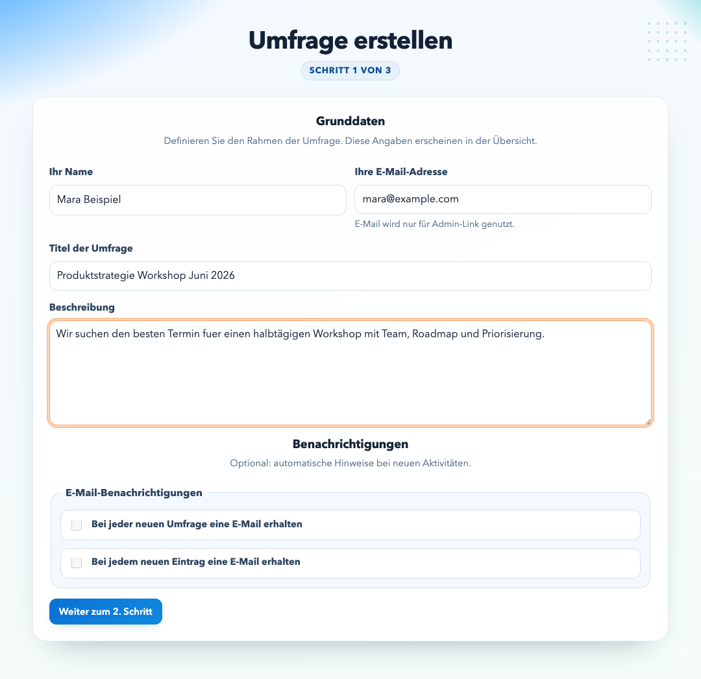
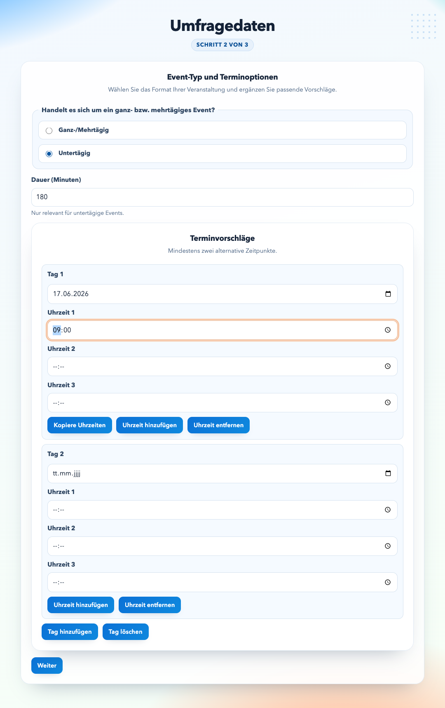
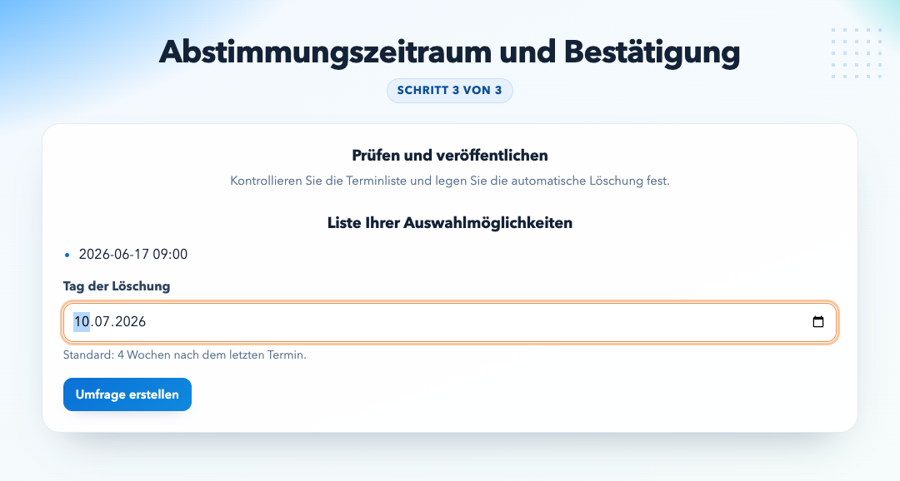
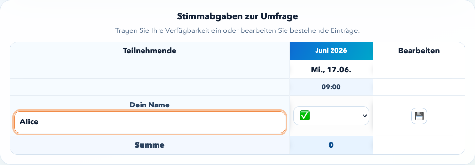
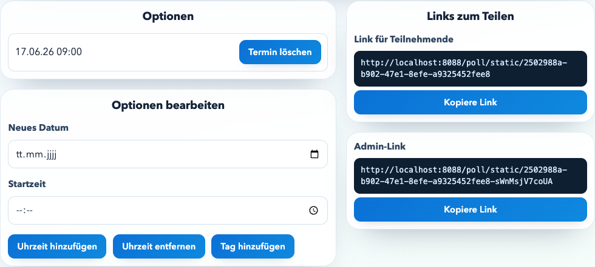

<p align="center">
  <strong>Woodle lets you create a scheduling poll in 3 steps, share a participant link, and manage everything from a focused admin view.</strong>
</p>

<p align="center">
  
  
</p>

<p align="center">
  
  
</p>

<p align="center">
  
</p>

# Woodle

## Overview

Woodle is a date‑poll application similar to Doodle but without the ads. Users create a poll, share a participant link, and collect votes in a tabular view with inline editing. Admins manage options via a secret admin link. Also I wanted to add some features i never found on any other Doodle clone.

Also the source code is written by claude code and codex only. The requirements and technical guidelines were provided by the developer.

## Tech Stack

*   Java + Spring Boot
*   Thymeleaf templates
*   HTMX for partial updates
*   Gradle build
*   Amazon S3 persistence (no database)
*   JaCoCo for coverage, Pitest for mutation testing

## AWS Resources and Running Costs

The app currently only supports deployment on Amazon AWS and uses these AWS resources in production (but you can deploy where ever you want if you figure out how):

1.  Amazon S3 (static frontend bucket: `woodle-web-<env>`)
2.  Amazon S3 (poll data bucket: `woodle-polls-<env>`)
3.  Amazon CloudFront (CDN for frontend)
4.  Amazon API Gateway HTTP API (public API entry point)
5.  AWS Lambda (Spring backend runtime)
6.  Amazon CloudWatch Logs (Lambda + API logs)
7.  AWS Route 53 (DNS for `qs.woodle.click`/`api.qs.woodle.click` and `woodle.click`/`api.woodle.click`)
8.  AWS Certificate Manager (TLS certificates for domains)
9.  AWS Budgets + Cost Anomaly Detection (cost monitoring)

Resources that generate the primary running costs:

*   `Amazon S3`: storage, PUT/GET requests, and data transfer out
*   `CloudFront`: requests and data transfer out
*   `API Gateway HTTP API`: requests (and payload processing)
*   `AWS Lambda`: invocations and execution duration (plus memory size)
*   `CloudWatch Logs`: log ingestion and retention storage
*   `Route 53`: hosted zone and DNS query volume

Cost behavior at idle:

*   No always-on compute (no EC2/ECS/RDS), so idle cost is mostly S3/CloudFront/API baseline traffic, DNS, and retained logs.

## Architecture

Hexagonal structure with clear boundaries:

```
io.github.bodote.woodle
├── application
│   ├── port
│   │   ├── in
│   │   └── out
│   └── service
├── domain
│   ├── model
│   ├── event
│   └── exception
├── adapter
│   ├── in
│   │   └── web
│   └── out
│       ├── persistence
│       └── integration
└── config
```

Rules:

*   `domain` depends on nothing else.
*   `application` depends only on `domain`.
*   `adapter` depends on `application` + `domain` (+ `config` if needed).
*   `config` can depend on all; nothing depends on `config`.

## URL Patterns

*   Create poll: `/poll/new`
*   Active poll count (HTMX/footer): `/poll/active-count` (alias API: `/v1/polls/active-count`)
*   Participant link: absolute URL based on current origin, e.g. `https://qs.woodle.click/poll/<UUID>`, `https://woodle.click/poll/<UUID>`, or `http://localhost:8088/poll/<UUID>`
*   Admin link: absolute URL based on current origin, e.g. `https://qs.woodle.click/poll/<UUID>-<admin-secret>`, `https://woodle.click/poll/<UUID>-<admin-secret>`, or `http://localhost:8088/poll/<UUID>-<admin-secret>`

## Step-1 Static + Lambda Warm-Up Architecture

Step 1 (`/poll/new-step1.html`) is a **static HTML file** served directly from S3 via CloudFront — it is **not** rendered by the Lambda/Spring Boot backend. This is intentional:

*   CloudFront delivers the page instantly, with no Lambda cold-start delay.
*   While the user fills in the form, HTMX fires a background request to `/poll/active-count` (`Anzahl aktiver Umfragen`). This request warms up the Lambda container in the background; the number itself is cosmetic.
*   By the time the user clicks `Weiter zum 2. Schritt`, Lambda is already warm and responds immediately.

**Consequence:** Two files must be kept in sync manually:

*   `src/main/resources/static/poll/new-step1.html` — the real page (served from S3/CloudFront, uses `window.WOODLE_EMAIL_ENABLED` / `window.WOODLE_BACKEND_BASE_URL` from `runtime-config.js`)
*   `src/main/resources/templates/poll/new-step1.html` — Thymeleaf source used only for server-side HTMX fragments (e.g. the email-check field swap)

## Step-1 UX Optimizations

*   The footer shows **`Anzahl aktiver Umfragen`** and loads the value via HTMX from `/poll/active-count` with a spinner fallback while loading.
*   Step-1 submit (`Weiter zum 2. Schritt`) uses a transient error handler for `502/503/504` with up to **10 retries** and **1000ms** delay.
*   The loading hint `Schritt 2 wird geladen...` includes a spinner and is shown with a short delay (200ms), so very fast responses do not flicker.
*   The active poll count request uses the same transient retry strategy (**10 retries**, **1000ms**).
*   Step 1 does not prewarm `/poll/step-2` in the background; wizard session state starts only after the user submits to `/poll/step-2`.
*   The only background request on step 1 is `/poll/active-count`, which is read-only and does not start wizard session state.
*   HTMX is served from a local static asset (`/js/vendor/htmx.min.js`) instead of third-party CDNs.

## Email Delivery

*   Poll creation can send an author confirmation email.
*   Email sending is environment-driven via:
    * `woodle.email.enabled`
    * `woodle.email.from`
    * `woodle.email.subject-prefix`
*   When disabled, the app uses a no-op sender.
*   When enabled, the app uses AWS SES (`SesV2Client`).
*   If delivery fails during creation, the admin page is opened with `?emailFailed=true` and shows a warning so links can be shared manually.
*   Step 1 offers two notification opt-ins (`notifyOnVote`, `notifyOnComment`). When `woodle.email.enabled=true` (qs/prod), both checkboxes are pre-checked by default; the user can deselect them. Locally (`woodle.email.enabled=false`), the checkboxes are disabled and unchecked. Previously stored user preferences (localStorage) take precedence over the default.

## Persistence & Data Lifecycle

*   No user accounts.
*   Each poll has a UUID and a secret admin token.
*   Polls are stored as a single JSON per UUID in S3.
*   Poll JSON includes a top-level `schemaVersion` field. Default value is `"1"` (configurable via `woodle.poll.schema-version`).
*   Rule for future schema changes: increment `schemaVersion` and add/maintain migration logic for older versions before rollout.
*   Read-time migration: when a poll is loaded and `schemaVersion` is missing or lower than `woodle.poll.schema-version`, the app converts it to the current schema and immediately overwrites the S3 object before returning the poll to the UI.
*   Polls are deleted after the expiry date.

## Product Spec (Date Poll)

The full, evolving product spec lives in:

*   `/Users/bodo.te/dev/woodle/woodle-create-poll-date-spec.md`

It includes:

*   Step‑1/2/3 creation flow
*   Event type logic (all‑day vs. intraday)
*   Admin view requirements
*   Participant table with inline edit + add row

## Testing Strategy (Summary)

*   Exactly one `@SpringBootTest` class (`*IT.java`) contains integration + Playwright E2E.
*   Most tests are `@WebMvcTest` and focus on behavior/spec, not implementation details.
*   HTML tests avoid layout details (colors, typography); they assert required elements, ordering, and behavior.
*   Unit tests only when coverage cannot be achieved via `@WebMvcTest`.
*   Coverage target: **95% instruction**, **90% branch**.

Full strategy:

*   `/Users/bodo.te/dev/woodle/test-strategie.md`

## Running Tests

```
# Unit tests (fast)
./gradlew test

# Integration tests only
./gradlew test --tests '*IT'

# Coverage
./gradlew jacocoTestReport

# Coverage gates (enforced)
./gradlew check

# Mutation testing
./gradlew pitest
```

## Run and Deploy Modes

For fast local feedback during feature work, run the classic JVM mode:

```bash
./gradlew bootRun
```

The AWS deployment script supports two runtime modes:

- `DEPLOY_RUNTIME=jvm` (default): builds `bootJar` and deploys `Dockerfile.lambda`
- `DEPLOY_RUNTIME=native`: builds a GraalVM native image inside Docker and deploys `Dockerfile.lambda.native`

JVM deployment example:

```bash
./aws-deploy.sh
```

Native deployment example:

```bash
DEPLOY_RUNTIME=native ./aws-deploy.sh
```

Production deployment example:

```bash
./aws-deploy.sh -prod
```

Dry-run example (validate config/preflight only, no AWS or Docker changes):

```bash
DRY_RUN=true DEPLOY_RUNTIME=native ./aws-deploy.sh
```

### Native AWS Guardrails (GraalVM)

For `DEPLOY_RUNTIME=native`, keep these rules to avoid runtime failures on Lambda:

1. Build and runtime image must use compatible libc.
   - Do not mix a glibc-built binary with a musl runtime image (for example Alpine).
   - Current safe baseline: build in Amazon Linux and run in Amazon Linux.
2. Keep required build tools in the native build image.
   - `xargs` is required by the native build pipeline (`findutils` package).
3. Expect first cold start to be slower than warm invocations.
   - CloudWatch may show a long `INIT_REPORT` while Spring Boot + adapter initialize.
4. After each native deploy, run an AWS smoke test on the public URL:
   - create poll (step 1 -> step 3)
   - publish poll
   - participant vote `Speichern`
   - reopen row via `Bearbeiten`
   - edit and `Speichern` again
5. If full `sam deploy` is blocked by CloudFront custom-domain conflicts, fix the domain mapping first.
   - Temporary Lambda-only image update can validate backend behavior, but does not replace a clean stack deploy.

## Local E2E (Playwright + LocalStack)

Start LocalStack (S3):

Start the app (S3 enabled):

Run E2E:

Cleanup:

## Quality & Workflow

*   Test‑first, incremental development.
*   Qodana check:
*   Nullability: use JSpecify with `@NullMarked` in the base package via `package-info.java`.
*   `DTO` suffix is reserved for public API transfer types only.
*   Do not use `Optional` as a method parameter.

Operational note:

*   If Playwright/Chrome hangs with `Wird in einer aktuellen Browsersitzung geöffnet`, fully quit Chrome and restart it.

## References

*   Tech stack and architecture: `/Users/bodo.te/dev/woodle/woodle-tech-stack.md`
*   Test strategy: `/Users/bodo.te/dev/woodle/test-strategie.md`
*   Product spec: `/Users/bodo.te/dev/woodle/woodle-create-poll-date-spec.md`
*   AWS deployment guide: `deploy-on-aws.md` (architecture, deployment flows, smoke checks)
*   Native deployment gotchas: `docs/native-deploy-gotchas.md` (GraalVM/AOT pitfalls, logs, smoke checks)
*   HTMX usability guidance: `docs/usability-htmx-guide.md` (UX and interaction rules for HTMX pages)
*   HTMX vs. additional JavaScript in this repo: `docs/htmx-javascript-readme.md` (why HTMX is usually sufficient here and where JavaScript is intentionally added)
*   Infra module overview: `infra/README.md` (AWS infrastructure structure and templates)
*   IAM policy notes for deploy identity: `infra/iam-deploy-identity-policies.md` (required deployment permissions)

```
docker run --rm -it -v "$PWD":/data -w /data jetbrains/qodana-jvm-community:latest
```

```
docker stop woodle-localstack && docker rm woodle-localstack
```

```
./gradlew test --tests '*E2E*'
```

```
./gradlew bootRun --args='--woodle.s3.enabled=true --woodle.s3.endpoint=http://localhost:4566 --woodle.s3.region=eu-central-1 --woodle.s3.pathStyle=true --woodle.s3.bucket=woodle'
```

```
docker run -d --name woodle-localstack -p 4566:4566 localstack/localstack:3.1.0
docker exec woodle-localstack awslocal s3 mb s3://woodle
```
